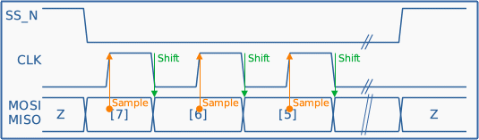
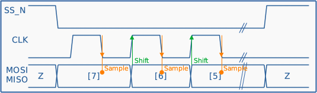
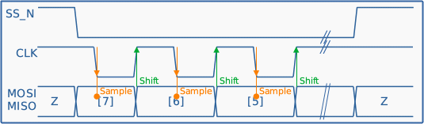
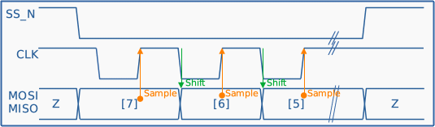
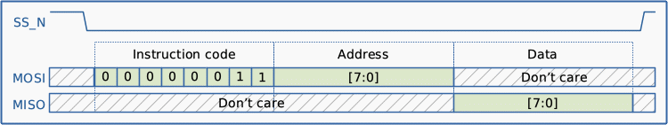
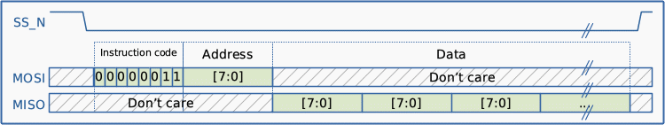
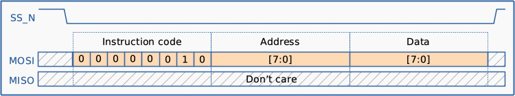
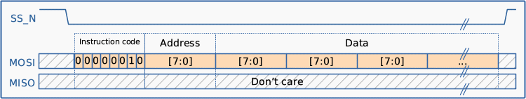

# spi_slave_tmct
SPI slave (SPI to bus) module  
[日本語はこちら](#anchor0_ja)

spi_slave_tmct is a basic SPI slave IP core that provides the basic framework for the implementation of custom SPI slave devices.  
The core provides a means to read and write up to 256 8-bits registers. These registers can be connected to the users custom logic, thus implementing a simple control and status interface.  
Please note that this module is distributed under the 3-article BSD license. You are free to use it as long as you do not violate the terms of use.

spi_slave_tmct は、基本的なカスタムSPIスレーブデバイスを実装するためのフレームワークIPコアです。  
8ビットのレジスタを最大256個まで読み書きする手段を提供します。これらのレジスタはユーザーのカスタムロジックに接続することができ、シンプルな制御およびステータスインタフェースを実装することができます。  
本モジュールは3条項BSDライセンスのもとに配布されます。利用条項に違反しない限り自由にご利用ください。  
※日本語の解説文は[英語の解説文の下](#anchor0_ja)にあります。

---
## Table Of Contents
- [File Organization](#anchor1_en)
- [Input/Output Signals](#anchor2_en)
- [Operation](#anchor3_en)
- [Resource Utilization](#anchor4_en)

## File Organization
spi_slave_tmct is composed of the following four files.  
The file names and the role of each file are shown below.

| File name | Details |
| :-- | :-- |
| spi_slave_top.sv | The main body of the ip core module. |
| spi_slave.sv | SPI engine |

A sample implementation of a simple register using this module is included in the */sample* folder.

| File name | Details |
| :-- | :-- |
| sample/spi_slave_sample_top.sv | This is the top module of the sample implementation. |
| sample/regs.sv | Example of register implementation. |

## Input/Output Signals
Details on the signals input and output for spi_slave_top.sv are shown below.  

| Signal name | Direction (from/to this module) | Details |
| :-- | :-- | :-- |
| i_clk         | Input  | Operating clock input. At least i_spi_clk frequency×6 is required. For example, if the i_clk is 50 MHz, the i_spi_clk must be less than 8.3 MHz. If i_clk is too slow, this core will not operate properly because it cannot identify the state transitions of i_spi_clk at the correct time. |
| i_reset       | Input  | Asynchronous reset input.(Active High) |
| i_spi_mode[1:0] | Input  | SPI mode select input. 2'b00 = Mode0 2'b01 = Mode1 2'b10 = Mode2 2'11 = Mode3 It must be determined before i_spi_ss_n is asserted and must remain in that state while it is asserted. |
| i_spi_ss_n | Input | SPI chip select input.(Active low) When i_spi_ss_n is negated(= goes High), the SPI engine of this core discards the current communication state and returns to the standby state. |
| i_spi_clk | Input  | SPI clock input. |
| i_spi_mosi | Input | SPI Master-Out-Slave-In. |
| o_spi_miso | Output | SPI Master-In-Slave-Out. |
| o_bus_wr      | Output | Write strobe output to the internal bus system.(1 i_clk cycle pulse, Active High) |
| o_bus_addr[7:0] | Output  | Address output to the internal bus system. |
| i_bus_data[7:0] | Input  | Data input from the internal bus system. |
| o_bus_data[7:0] | Output | Data output to the internal bus system. |

Signal specifications for each SPI mode are shown below:  

| Mode |  |
| :--: | :-- |
| 0 |  |
| 1 |  |
| 2 |  |
| 3 |  |

## Operation
The core has 8bit address space(=up to 256 registers) that can be accessed via SPI.  
This core can be used in any mode of SPI Mode 0, 1, 2 and 3. It can be selected by i_spi_mode[1:0] status.  
All accesses are performed in the following order: INSTRUCTION, ADDRESS, and DATA. INSTRUCTION and ADDRESS are always output from the SPI host. The output source of subsequent DATA depends on the INSTRUCTION:

Write instruction ... Output from the SPI host (to MOSI)  
Read instruction ...  Output from this core (to MISO)

After a data read or write, the register address pointer is automatically incremented.  
There is no limit to the range over which the register address pointer is incremented, and it will return to 0 after 255.  
Some Write/Read examples are shown below.  

### Single read operation
The SPI host outputs the instruction (0x03) and address in order to the MOSI. (When the last byte of the address is determined, that address is output to o_bus_addr[7:0].)  
From the next clock cycle, i_bus_data[7:0] is output to MISO. The protocol diagram is shown below.

> The period of time between the determination of o_bus_addr and its reflection in i_bus_data should be as fast as possible. (preferably within 1 i_clk cycle)

### Burst read operation
The basic access protocol is the same as for single read operation.  
When data is continuously read from the host, o_bus_addr[7:0] is automatically incremented by 1.  
In other words, data at consecutive addresses can be read by sending read instruction (0x03) and addresses from the host, then repeating read accesses to the SPI.  
The protocol diagram is shown below.

### Single write operation
The SPI host outputs instruction (0x02), addresses, and data to be written to MOSI in this order.  
When the address and data are determined, valid values are output to o_bus_addr[7:0] and o_bus_data[7:0], and o_bus_wr is asserted for 1 i_clk cycle as the write strobe.  
The protocol diagram is shown below.

### Burst write operation
The basic access protocol is the same as for single write operation.  
When data is continuously write from the host, o_bus_addr[7:0] is automatically incremented by 1.  
In other words, data at consecutive addresses can be write by sending write instruction (0x02) and addresses from the host, then repeating write accesses to the SPI.  
The protocol diagram is shown below.

## Resource Utilization
| Target device | Logic Elements/Macrocells | Memory bits |
| :-- | :-: | :-: |
| EP3C16F484C6 (Intel Cyclone III) | 122 | 0 |

---

## もくじ
- [ファイル構成](#anchor1_ja)
- [入出力信号](#anchor2_ja)
- [使い方](#anchor3_ja)
- [リソース消費量](#anchor4_ja)

## ファイル構成
spi_slave_tmctは、以下の2つのファイルから構成されています。 
以下に、ファイル名と各ファイルの役割を示します。

| File name | Details |
| :-- | :-- |
| spi_slave_top.sv | IPコアモジュールのトップレベルエントリファイルです。 |
| spi_slave.sv | SPIエンジンです。 |

このモジュールを使った簡単なレジスタの実装例は */sample* フォルダにあります。

| File name | Details |
| :-- | :-- |
| sample/spi_slave_sample_top.sv | 実装サンプルのトップモジュールです。 |
| sample/regs.sv | レジスタ実装例です。 |

## 入出力信号
spi_slave_top.sv に入出力される信号の詳細は以下の通りです。

| 信号名 | このモジュールからの 入出力方向 | 詳細 |
| :-- | :-- | :-- |
| i_clk         | Input  | 動作クロック入力です。 最低でも i_spi_clk 周波数の6倍は必要です。 たとえば i_clk が 50 MHzの場合、i_spi_clk は 8.3 MHz 以下である必要があります。 i_clk が遅すぎる場合、i_spi_clk の遷移が正しく捕捉できないためこのコアは正常に動作しません。 |
| i_reset       | Input  | 非同期リセット入力です。(Active High) |
| i_spi_mode[1:0] | Input  | SPI モード選択入力です。 2'b00 = Mode0 2'b01 = Mode1 2'b10 = Mode2 2'11 = Mode3 この信号は i_spi_ss_n がアサートされる前に確定し、ネゲートされるまでその状態を保持する必要があります。 |
| i_spi_ss_n | Input | SPI チップセレクト入力です。(Active low) i_spi_ss_n がネゲート(=High)になった場合、このコアのSPIエンジンは現在の通信状態を破棄して待機状態に戻ります。 |
| i_spi_clk | Input  | SPI クロック入力です。 |
| i_spi_mosi | Input | SPI データ入力(いわゆるMOSI)です。 |
| o_spi_miso | Output | SPI データ出力(いわゆるMISO)です。 |
| o_bus_wr      | Output | 内部バスに対するライトストローブ信号出力です。(1 i_clk 期間のパルスで、Active High です) |
| o_bus_addr[7:0] | Output  | 内部バスに対するアドレス出力です。 |
| i_bus_data[7:0] | Input  | 内部バスからのデータ入力です。 |
| o_bus_data[7:0] | Output | 内部バスへのデータ出力です。 |

各SPIモードにおける信号仕様は以下の通りです。  

| Mode |  |
| :--: | :-- |
| 0 |  |
| 1 |  |
| 2 |  |
| 3 |  |

## 使い方
このコアはSPI経由でアクセス可能な8bitのアドレス空間（＝最大256本のレジスタ）を持っています。  
SPI Mode 0, 1, 2, 3 のどのモードにも対応しています。i_spi_mode[1:0] の状態によって選択することができます。  
すべてのアクセスは、INSTRUCTION→ADDRESS→DATA の順です。INSTRUCTION と ADDRESS は常に SPI ホストから出力されます。続く DATA の出力元は INSTRUCTION に依存します。

INSTRUCTION が Write の場合 ... SPIホストからこのコアへ入力(MOSI)  
INSTRUCTION が Read の場合 ...  このコアからSPIホストへ出力(MISO)

書き込み・読み込み操作後、レジスタアドレスポインタは自動的にインクリメント(+1)されます。  
レジスタアドレスポインタのインクリメント範囲に制限はありませんが、255 を超えると 0 に戻ります。  
いくつかの書き込み・読み込み例を以下に示します。  

### 1バイト Read
SPI ホストは Readインストラクション(0x03) と アドレス を順に MOSI に出力します。(このとき、アドレスの最後のバイトが確定するとそのアドレスが o_bus_addr[7:0] に出力されます)。  
次のクロックサイクルからは i_bus_data[7:0] が MISO に出力されます。プロトコル図を以下に示します。

> o_bus_addr が確定してから i_bus_data に反映されるまでの期間はできるだけ短くする必要があります。(できれば 1 i_clk サイクル以内が望ましい)

### 連続バイト Read
基本的なアクセスプロトコルは 1バイト Read動作と同じです。  
ホストから連続してデータを読み出す場合、o_bus_addr[7:0] は自動的に1ずつインクリメントされます。  
すなわち、ホストから Readインストラクション(0x03）と アドレス を出力した後、SPIに Readアクセスを繰り返すことで、連続したアドレスのデータを読み出すことができます。  
以下にプロトコル図を示します。

### 1バイト Write
SPI ホストは Writeインストラクション(0x02)、アドレス、書き込むデータ を順に MOSI に出力します。  
アドレスとデータが確定すると o_bus_addr[7:0] と o_bus_data[7:0] に有効な値が出力され、書き込み有効信号として o_bus_wr が 1 i_clk cycle 分アサートされます。  
プロトコル図を以下に示します。

### 連続バイト Write
基本的なアクセスプロトコルは 1バイト Write動作と同じです。  
ホストから連続してデータを書き込む場合、o_bus_addr[7:0] は自動的に1ずつインクリメントされます。  
すなわち、ホストから Writeインストラクション(0x02) と アドレス を出力した後、SPIに Writeアクセスを繰り返すことで、連続したアドレスにデータを書き込むことができます。  
プロトコル図を以下に示します。

## リソース消費量
| Target device | Logic Elements/Macrocells | Memory bits |
| :-- | :-: | :-: |
| EP3C16F484C6 (Intel Cyclone III) | 122 | 0 |

